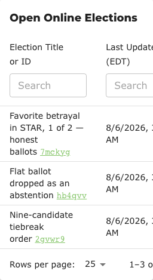
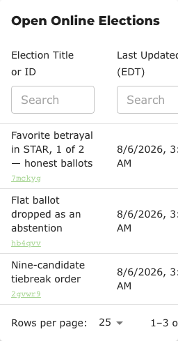
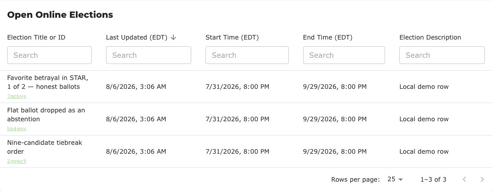
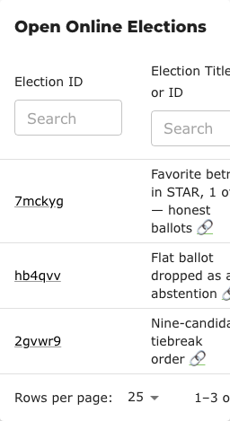
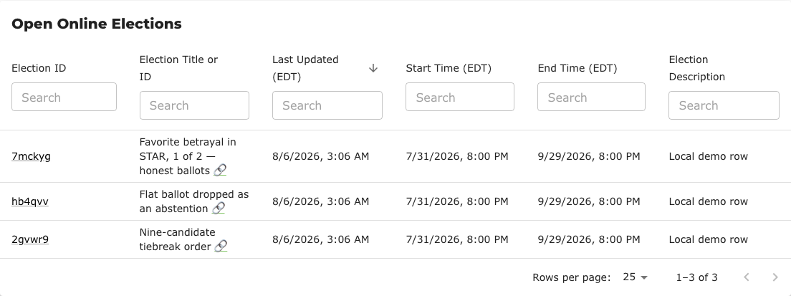

# #1059 / #1524 — finding an election by the identifier its admin actually holds

**Issue [#1059](https://github.com/Equal-Vote/bettervoting/issues/1059)** filed 2025-10-31, still open. **PR [#1524](https://github.com/Equal-Vote/bettervoting/pull/1524)** opened 2026-08-15, addressing the searchability half. Test case: [BV2285d](../test_cases/BV2285d-title-filter-matches-election-id.md).

## The finding

The election ID is the only identifier a poll admin actually holds. It is what they pasted into the invitation that went to their voters, it is in the address bar, and it is what the API and the JSON export key on. It is also the only identifier the election tables neither display nor match — so typing it into the one search box on `/manage` returns nothing, with no indication why. (What the page says instead is its own defect: [#1525](https://github.com/Equal-Vote/bettervoting/issues/1525).)

Recovering the match today means knowing your own title conventions, or opening rows one at a time to read the address bar.

## Two requests, very different costs

#1059 asks for two things that are easy to read as one:

| | Ask | Cost |
|---|---|---|
| **Searchable** | typing an ID finds the row | ~10 lines, no layout change |
| **Visible** | the ID is printed in the list | a column, or a change to how the title cell renders |

They are not interchangeable. Search only helps someone who **already has** the ID and is typing it in; it never helps them *learn* an ID they do not have. Reading row 12's ID off the screen is the visibility ask, and search does nothing for it.

PR #1524 does the first and deliberately leaves the second open.

## Why a column is expensive here

In `EnhancedTable` a column **is** a search box: every head cell with `filterType: 'search'` renders its own `TextField` at `minWidth: 120` (`EnhancedTable.tsx:449`). There is no responsive column hiding anywhere in the component — no `useMediaQuery`, no breakpoint rules, just `Table sx={{ minWidth: 750 }}` — so a phone already scrolls the table sideways.

Measured in-page:

| Page / viewport | Columns | Table width | Container |
|---|---|---|---|
| production `/browse`, 375px | 5 | 760px | 311px |
| `/manage`, 375px | 6 | ~912px | 311px |
| `/browse` + an ID column, 320px | 6 | **912px** | 256px |

The last row is measured, not estimated — see the prototype below.

## Three ways to make the ID visible

All three were built and screenshotted locally against `main`, on `/browse` at 320px and 1280px.

### A — ID inline, replacing the link emoji

The title cell already renders `{title}&nbsp;<a href={`/${id}`}>🔗</a>`. Swap the decorative emoji for the ID itself, so the link affordance carries information:

Table width at 320px: **769px** (from 760). Cheap, but the ID runs on from the title as if it were part of it, and on a narrow column it lands wherever the title happens to wrap.

### B — ID on its own line under the title

Table width at 320px: **760px — unchanged.** Costs vertical space, which is the dimension a phone has. The ID is visually distinct from the title, monospaced, and is the link. This also makes the PR's relabelled "Election Title or ID" header self-evident: the box names two things, and the cell below it shows two things.

Desktop:

### C — a dedicated Election ID column

Table width at 320px: **912px**, and the screenshot shows the real cost — the ID column takes the first screen and pushes the **title** off it. On a phone you now scroll sideways to read what an election is called. It is the best option on a wide screen and the worst on a narrow one:

### Recommendation

**B.** It is the only one that adds visibility at zero horizontal cost, and it puts the ID where the reader is already looking. C is defensible if the tables ever get responsive column hiding, which they do not have today.

Nothing here is decided, which is why no test case asserts it — BV2285d only covers search.

## Provenance

| Claim | How established |
|---|---|
| All three variants' widths and rendering | **executed** — local `main` at `7bc75a82`, three seeded open elections, Playwright at 320 and 1280 |
| Production `/browse` at 375px is 760px in a 311px container | **executed** — measured in-page on bettervoting.com |
| `/manage` at 375px ≈ 912px | computed from the same per-column width, **not** measured (needs a login) |
| No responsive column hiding exists | read from `EnhancedTable.tsx` — no `useMediaQuery`, no breakpoint `display` rules |

## Related

[#1059](https://github.com/Equal-Vote/bettervoting/issues/1059) · [PR #1524](https://github.com/Equal-Vote/bettervoting/pull/1524) · [#1525](https://github.com/Equal-Vote/bettervoting/issues/1525) · [#770](https://github.com/Equal-Vote/bettervoting/issues/770) (the ~20-field redesign this was deliberately scoped away from) · [BV2285 index](../test_cases/BV2285-index.md) · user documentation drafted from the same reading: [`docs_proposals/help/finding_your_elections.md`](../docs_proposals/help/finding_your_elections.md)
