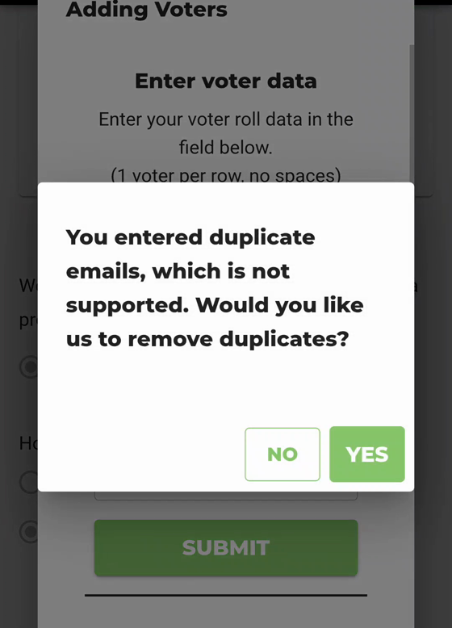
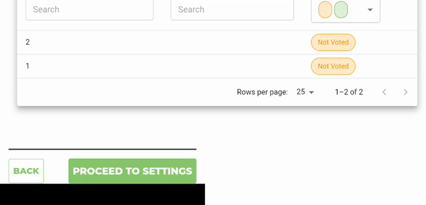
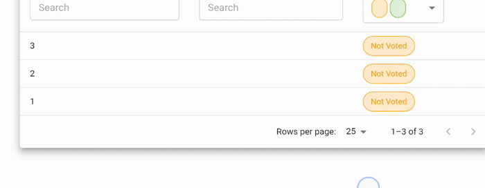

# Add Voters: the duplicate check keys on email only — so a voter-ID list is always "duplicates", and all but one row is silently discarded

**Status: UNFILED (ours).** Found 2026-08-14 while reviewing
[#1512](https://github.com/Equal-Vote/bettervoting/issues/1512), whose screen recording documents it
without naming it. No upstream issue covers it — searched *duplicate voter*, *voter roll*, *add
voters*.

**Severity: data loss, silent, on the happy path of every admin-managed-voter-ID election.**

---

## The bug

`packages/frontend/src/components/Election/Admin/AddElectionRoll.tsx`, upstream `main` @ `7bc75a82`
(function last touched 2026-05-21, `afa5c8c4`):

```ts
function duplicatesExist(pendingRolls: RollInput[]): boolean {     // :173
    const seen = new Set<string>();
    for (const roll of pendingRolls) {
        const email = (roll.email || "").trim().toLowerCase();     // only ever email
        if (seen.has(email)) return true;
        ...
```

`removeDuplicates()` (`:158`) keys the same way.

The dialog builds each row from whichever columns are ticked (`:76`–`:88`). In **admin-managed voter
ID** mode only `roll.voter_id` is assigned; `roll.email` stays `undefined`. Every row therefore keys
to the empty string, so:

1. **`duplicatesExist` returns true for any submission of 2 or more rows** — the second row always
   collides with the first. The admin is told *"You entered duplicate emails, which is not supported.
   Would you like us to remove duplicates?"* while the Email checkbox is unticked and no email exists
   anywhere in the input.
2. **Answering YES calls `removeDuplicates`, which keeps one row per key — so exactly one row** — and
   posts it. The other rows are dropped with no message, no count, and no trace.

Answering NO returns from `onSubmit` without posting anything, so the two available answers are
"add one voter" and "add none". There is no path that adds the list.

The CSV import path (`:137`, `:146`) has the same two calls and the same outcome.

## Evidence — the reporter's video on #1512

Screen recording attached to #1512
([user-attachments/effc8f69…](https://github.com/user-attachments/assets/effc8f69-9e02-4473-8e18-c547beb42136)),
40 s, Vivaldi on Android, election `bettervoting.com/44v…` (id truncated by the URL bar).
Mode: **Yes** to a pre-defined voter list, **Admin-managed voter IDs**. The Email checkbox is
unticked in every frame.

| Video time | What is on screen | Roll count |
|---|---|---|
| 0.5 s | Voter table before any of this | **1–2 of 2** (IDs 1, 2) |
| 2–9 s | Types `3`, `4`, `5` into Voter Data — three rows | |
| 12–15 s | SUBMIT, then *"You entered duplicate emails…"* NO / YES | |
| 19.5 s | Back on Manage Voters | **1–3 of 3** (IDs 1, 2, 3) |
| 23–29 s | Second attempt, two rows (`4`, `5`), same prompt, twice | |
| 31 s | | **1–4 of 4** |
| 33–36 s | Third attempt, one row (`5`) | |
| 39 s | | **1–5 of 5** |

Three rows in, one voter added. Then two rows in, one voter added. The reporter ends up entering the
voters one at a time — which reads in the video as a person patiently working around something, and
is why the issue they eventually filed is about the scrollbar.







## Reproduction — the real functions, executed

`analysis/add-voters-probe/add_roll_repro.mjs` transcribes the row-building loop out of `onSubmit`
(`:55`–`:89`), `duplicatesExist` (`:173`) and `removeDuplicates` (`:158`) **verbatim** from
`AddElectionRoll.tsx` @ `7bc75a82`, stubs only the React edges (`setSnack`, `confirm`, `postRoll`),
and runs the submit path with `confirm()` answered by the caller. Recorded output in
`analysis/add-voters-probe/run.out`:

```
=== admin-managed voter IDs (Email unticked) ===
2 distinct IDs, answer YES                     typed 2 -> posted 1  | prompted: YES | alpha
3 distinct IDs, answer YES                     typed 3 -> posted 1  | prompted: YES | alpha
3 distinct IDs, answer NO                      typed 3 -> posted 0  | prompted: YES | (nothing)
1 ID (no prompt possible)                      typed 1 -> posted 1  | prompted: no  | alpha
3 IDs with a real duplicate                    typed 3 -> posted 1  | prompted: YES | alpha

=== BetterVoting-managed IDs / email list (the mode it was written for) ===
3 distinct emails, answer YES                  typed 3 -> posted 3  | prompted: no  | a@x.com, b@x.com, c@x.com
3 emails with a real duplicate                 typed 3 -> posted 2  | prompted: YES | a@x.com, b@x.com

=== the reporter's session, replayed (roll starts at 2) ===
  submitted 3  row(s) -> roll 2 -> 3   (video shows 2 -> 3)
  submitted 2  row(s) -> roll 3 -> 4   (video shows 3 -> 4)
  submitted 1  row(s) -> roll 4 -> 5   (video shows 4 -> 5)
```

Three things this settles that reading alone did not:

1. **The survivor is the first row** — `alpha`, every time.
2. **NO posts nothing.** The two answers on offer really are "add one voter" and "add none".
3. **The email mode is fine**, which is both the contrast that diagnoses the bug and the regression
   that any fix has to keep passing: 3 distinct emails go in untouched, and a genuine duplicate is
   caught and one row removed — 3 in, 2 out.

And the replay lands on the reporter's production numbers exactly: **2 → 3 → 4 → 5** for submissions
of 3, 2 and 1 rows.

**What has not been done:** a click-through of the live admin UI. The browser automation available in
this session could not deliver input events to the page. The UI evidence is therefore the reporter's
own production recording (above), which the harness reproduces number for number. Anyone re-running
this should still do BV250a/b by hand — the harness proves the functions, the video proves the
outcome, and only a click-through proves the wiring between them.

**What is observed vs. derived.** The prompt, the row counts and the one-voter-per-submission arc are
observed in the video. The behaviour of the three functions is executed, not read (below). What
remains derived is only that the dialog calls them the way the file says it does.

## Why it has survived

- Email mode is the mode the code was written for, and there it is correct: real email keys, real
  duplicate detection.
- In voter-ID mode the failure is **quiet and plausible**. The admin is told the input was bad, is
  offered a fix, accepts it, and gets a shorter list — which looks like the fix working.
- The roll table shows the result, but an admin who just asked for "duplicates removed" has no reason
  to count.
- It only bites lists of 2 or more rows, and the natural first thing anyone types when trying the
  feature is one row.

## Suggested fix

Key on the columns actually in play rather than on email:

```ts
const rollKey = (roll: RollInput) =>
    [roll.voter_id, roll.email, roll.precinct]
        .map(v => (v || "").trim().toLowerCase())
        .join(" ");
```

Two things worth fixing in the same pass, because they are what made this unreadable to the reporter:

- **The message names the wrong field.** *"duplicate emails"* is hard-coded at `:98` and `:146`; it
  should name the column that actually collided, and it should be an `en.yaml` key like its
  neighbours (`admin_home.clear_voter_roll_confirm`) rather than an English literal in a component.
- **Say what was dropped.** `removeDuplicates` should report the count it removed — *"3 rows, 2
  duplicates removed, 1 voter added"* — so a silent discard becomes a visible one. This is the part
  that turns a wrong prompt into lost data, and it stays wrong even after the key is fixed if
  someone genuinely does paste duplicates.

## Before filing

Per this repo's ground rules this is a plain functional defect, not a guard or access finding, so it
goes straight to a GitHub issue rather than to Slack first. Two things to do before that:

1. **Click-through still outstanding** (BV250a/b by hand). The functions are executed and the
   production outcome is on video; the wiring between them is read, not run.
2. **Cross-reference #1512** rather than commenting on it. It is a different defect on the same
   screen, and the reporter's video is the best evidence for both.
