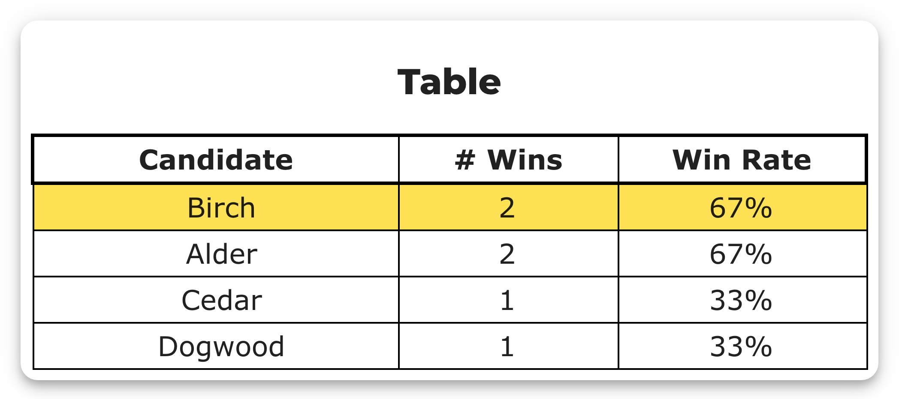

# Winner highlighting is positional, but `elected` is identity

**Status: FILED upstream as [#1480](https://github.com/Equal-Vote/bettervoting/issues/1480), 2026-08-04. Confirmed on production with a purpose-built election, [`8h4bvh`](https://bettervoting.com/8h4bvh/results) (BV2270). CLOSED as by-design 2026-08-20 — which relocates the defect to the backend; see [the closure section](#closed-as-by-design-which-relocates-the-defect-to-the-backend). Backend fix written and parked ([PARKED §7](../docs_proposals/PARKED_ready_for_bv.md)).**

Split out of [#1166](1166-ranked-robin-multiwinner-highlighting.md) deliberately. #1166 is a `good first issue` about a hard-coded `1`; this is a different defect that the #1166 fix ([PR #1479](https://github.com/Equal-Vote/bettervoting/pull/1479)) does not touch and was never meant to.

## The claim

Every results viewer that uses `ResultsBarChart`'s `stars` prop or `ResultsTable`'s `winningRows` prop highlights **the first *N* rows** of `summaryData.candidates`. But the winners are `results.elected`, which is built by a different mechanism. When the two disagree, the page names one candidate in its heading and puts the star and the gold row on another.

- `components/ResultsTable.tsx:34` — `style={i < winningRows ? winningStyle : {}}`
- `components/ResultsBarChart.tsx:57` — `((i < stars || d['star']) ? "⭐ " : "")`

Both are row-index tests. Neither component knows which candidates won.

## Why they can disagree in Ranked Robin

Two orderings, produced independently:

| | Built by | Ordered by |
|---|---|---|
| `summaryData.candidates` | `getSummaryData` → `sortCandidates(candidates, 'copelandScore')`, once, up front | `copelandScore` desc, then `tieBreakOrder` asc |
| `elected` | `runBlocTabulator` → `singleWinnerRankedRobin`, one round at a time | the tiebreak ladder |

Ranked Robin passes no `evaluate` callback to `runBlocTabulator`, so the summary array is never re-sorted into round-win order. That leaves the ladder free to disagree with the sort — and its second rung does exactly that:

```ts
// singleWinnerRankedRobin, RankedRobin.ts
const [left, right] = winners.slice(0, 2);
if (winners.length===2 && left.winsAgainst[right.id] != right.winsAgainst[left.id]){
  const [winner, loser] = left.winsAgainst[right.id] ? [left, right] : [right, left];
```

`winners` preserves the sorted order, so `left` is the row that sorts first. The rung then picks the **pairwise** winner, which may be `right`.

`tieBreakOrder` comes from `shuffleCandidatesForRandomTiebreak.ts` — a TinyRand shuffle seeded on `(rawVoteCount + hash(raceId)) >>> 0`. It is deterministic and it is published in the export, but it is a function of the **ballot count and the race id, never of how anyone voted**. So it carries no information whatsoever about who beat whom, and it agrees with the head-to-head result about half the time.

## Not hypothetical

The head-to-head rung is ordinary. It fired in the very poll #1166 was reported against — [`qq6qkp`](https://bettervoting.com/qq6qkp/results), round 1:

```
round 0: Baldur's Gate wins round with highest number of wins.
round 1: Dragon Age preferred over Mass Effect and/or KOTOR in runoff.   ← 7.5 – 7.5 tie
round 2: Mass Effect and/or KOTOR wins round with highest number of wins.
```

Nothing is visible there, for two independent reasons: Dragon Age also sorts first (`tieBreakOrder` 0 vs 3), and at `num_winners: 3` both tied candidates are elected anyway. Neither reason is a property of the code — both are luck.

## Reproduction

A four-candidate Ranked Robin, one winner, built so exactly two candidates tie at the top of the Copeland table with a decisive match between them.

Ballots — three voters:

```
1 × Alder  > Birch  > Cedar  > Dogwood
1 × Birch  > Cedar  > Dogwood > Alder
1 × Dogwood > Alder > Birch  > Cedar
```

Pairwise: Alder>Birch 2–1, Alder>Cedar 2–1, Dogwood>Alder 2–1, Birch>Cedar 3–0, Birch>Dogwood 2–1, Cedar>Dogwood 2–1.

Copeland: **Alder 2, Birch 2**, Cedar 1, Dogwood 1.

So `winners` = {Alder, Birch}, exactly two, and Alder beats Birch head-to-head → **Alder is elected**, deterministically, from the ballots alone. Where Alder and Birch *sit in the table* is decided by the seeded shuffle instead. When the shuffle puts Birch first, the page reads:

> ⭐ Alder wins ⭐ … and the star, and the gold row, are on **Birch**.

The shuffle re-rolls on every ballot cast (`"This ensures the tiebreak priority is reset after every vote"`), so a pair of mirror-image ballots — which cancel exactly, leaving every pairwise winner and every Copeland score untouched — re-rolls the display order without changing the election.

### The live election

**[`8h4bvh`](https://bettervoting.com/8h4bvh/results)** — BV2270, minted 2026-08-04, Ranked Robin, 1 winner.

Minted with the three ballots above; that draw put Alder first, so the page looked correct. Three mirror pairs were then cast — `Alder>Birch>Cedar>Dogwood` plus its exact reverse, which cancel on every one of the six matchups — and the third re-roll landed on a disagreeing order. Nine ballots now, tally identical to the three-ballot version: Copeland still 2/2/1/1, log still `Alder preferred over Birch in runoff.`




The heading names **Alder**. The star and the gold row are on **Birch**. Both candidates show `2` wins / `67%`, so the page gives a reader no way to tell which of the two actually won — the two signals contradict each other and the wrong one is more prominent.

From `GET /API/ElectionResult/8h4bvh`:

```
elected  : ['Alder']
tieBreakType : none
  row 0: Birch    copeland=2  tieBreakOrder=1
  row 1: Alder    copeland=2  tieBreakOrder=3
  row 2: Cedar    copeland=1  tieBreakOrder=0
  row 3: Dogwood  copeland=1  tieBreakOrder=2
logs: ['Alder preferred over Birch in runoff.']
```

Note `tieBreakType: none` — this is not a random-tiebreak election. The winner is fully determined by the ballots. Only the *row order* came from the shuffle.

## Scope

Ranked Robin is where it's demonstrable, because its ladder has a rung that ignores the sort key. The **shape** of the defect is shared: `ApprovalResultsViewer` — the viewer #1479 copies — highlights positionally too, and so will Ranked Robin and Plurality after #1479 lands. The fix is one prop, not one viewer.

**Correction (2026-08-20):** the paragraph above over-reached, and the over-reach probably invited the by-design close. Approval and Plurality *highlight* positionally but **cannot produce the mismatch**: their single-winner functions always elect `remainingCandidates[0]`, so their first rows can't be wrong (Approval additionally passes an `evaluate` callback). The defect is one method's, not one prop's — Ranked Robin is the only tabulator whose ladder has a rung that can leave the sort order. Withdrawn in the reply below.

## Suggested fix

**Superseded (2026-08-20)** — the maintainers' stated convention is that the frontend trusts the backend's order, which puts the fix in the backend instead; see [the closure section](#closed-as-by-design-which-relocates-the-defect-to-the-backend). Kept for the record:

The bar chart already supports it. `ResultsBarChartData` carries an optional per-row `star` flag, and `STARPRResultsViewer` already uses it (`star: winIndex(…) < page`). So:

```tsx
const electedIds = new Set(results.elected.map(c => c.id));
// …
data={candidates.map(c => ({name: c.name, votes: c.copelandScore, star: electedIds.has(c.id)}))}
```

`ResultsTable` needs one additive prop, keeping `winningRows` for the callers that don't care:

```tsx
const isWinner = (i: number) => winningRowIndexes ? winningRowIndexes.includes(i) : i < winningRows;
```

## Closed as by-design, which relocates the defect to the backend

Closed 2026-08-20 by the maintainer: tiebreaker edge cases are handled once, server-side, and "the frontend trusts the order from the backend by convention". That design is reasonable — and it is the reason this page's suggested frontend fix was the wrong end of the problem. It does not resolve the repro, though, because on `8h4bvh` the *backend's own two orderings* disagree: the heading reads `results.elected` (`Results.tsx:498`) and announces Alder, while the star and gold row read row order and sit on Birch. Under the stated convention, the defect is that Ranked Robin's backend doesn't deliver an order worth trusting.

The convention is not aspirational — it is implemented, per method (all verified at `main` @ `b089323f`):

| Tabulator | How `summaryData.candidates` becomes winners-first |
|---|---|
| STAR | `evaluate` callback `[winRound, runnerUpRound, score]` re-sorts after the rounds (`Star.ts:29`, mechanism at `Util.ts:321–338`) |
| Approval | `evaluate` callback `[score]` (`Approval.ts:30`); also order-safe by construction |
| Plurality | passes no `evaluate`, but order-safe by construction — `singleWinnerPlurality` always elects `remainingCandidates[0]` (`Plurality.ts:37`) |
| IRV / STV | `sortCandidates(candidates, 'hareScores', results.roundResults)` (`IRV.ts:164`) — passing `roundResults` makes win-round the first sort key (`Util.ts:190`) |
| Allocated Score | its own elected-first permutation (`AllocatedScore.ts:185–208`), added by maintainer commit `cd1c01d9` *"sort candidates meaningfully on backend"*, whose comment says other consumers should get the elected-first ordering "for free" |
| **Ranked Robin** | **nothing** — and it is the only method whose ladder has a rung that can leave the pre-sort (the head-to-head at `RankedRobin.ts:57` elects `right` while `left` stays in row 0) |

Three consequences, each verified:

- **[PR #1479](https://github.com/Equal-Vote/bettervoting/pull/1479) amplifies it.** That fix (correctly) extends highlighting from 1 row to the first `num_winners` rows — still positional. Once it lands, a multi-winner Ranked Robin race can mislabel up to *N* candidates instead of one.
- **The parked [#1469](1469-ranked-robin-degrees-of-ties.md) ladder fix widens it.** The 1st/2nd Degree rungs decide from pairwise margins the `copelandScore`/`tieBreakOrder` sort knows nothing about, so with the method's own ladder implemented correctly, `elected` leaves the sort order *more* often, not less.
- **The fix is one line, in the codebase's own idiom, and it is written.** `fix/1480-ranked-robin-summary-order` @ `7d679ba5` (worktree `bv-1480`, cut from `b089323f`) captures `runBlocTabulator`'s return and re-sorts exactly as IRV does: `sortCandidates(results.summaryData.candidates, 'copelandScore', results.roundResults)`. Row order is the only thing that changes — `elected`, every `tieBreakOrder` value, and `perm` are untouched *by construction*: the shuffle stamps `tieBreakOrder` and the controller snapshots `perm` (`getElectionResultsController.ts:141–146`) before the tabulator is called, so a re-sort inside the tabulator cannot reach them. Tests: a regression test that fails on `main` at exactly the defect (`summaryData.candidates[0]` is the pairwise loser), a value-preservation test, a no-tie control; RR suite 6/6 and full tabulator suite 55/55 green with the fix, `tsc` clean. It is also the first test coverage of the head-to-head rung at all — the existing "Ties" test's pair has a *drawn* head-to-head and falls through to the random rung. Parked per the freeze and the closure ([PARKED §7](../docs_proposals/PARKED_ready_for_bv.md)); it opens as a PR only if the reframe is accepted.

Next step: a reply on the closed issue accepting the convention, withdrawing the Scope over-reach, and offering the backend one-liner — reopen or a fresh backend-scoped ticket, maintainer's choice.

## Related

- [#1166](https://github.com/Equal-Vote/bettervoting/issues/1166) / [PR #1479](https://github.com/Equal-Vote/bettervoting/pull/1479) — the hard-coded `1`. Different defect, same two components.
- BV2261 / BV2262 in [star-voting-library](https://github.com/masiarek/star-voting-library) — frozen exports built to exercise the same tiebreak ladder, and the source of the `perm` / `tieBreakOrder` facts used above.
