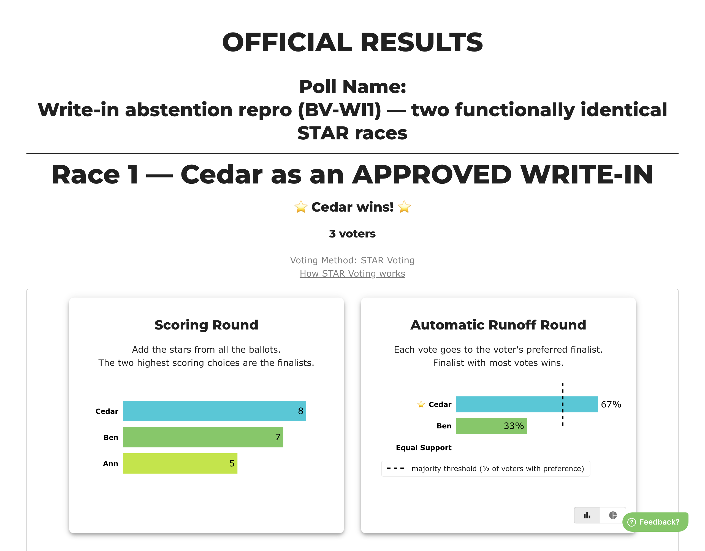

# BV-AB1 — an approved write-in discards ordinary ballots

> **Baseline capture — recorded before any fix.** Everything under *Actual result* is what BetterVoting
> does today (2026-08-02, production). The point of this page is to make the fix verifiable: when the
> change lands, re-run these steps and the *Expected after the fix* section is the assertion.
>
> **Provisional test ID.** `BV-AB1` is a local id, not a row in the
> [test-case sheet](https://docs.google.com/spreadsheets/d/1EXQsABY2qEu8kKQJGQdyQHn-C89hbCnNqZoGxKXZJNE/edit?gid=0#gid=0) yet.
> Paste-ready rows: [`BV-AB-sheet-rows.tsv`](BV-AB-sheet-rows.tsv).

## Purpose

Show that approving a write-in causes ordinary ballots to be dropped as abstentions, by putting the *same seven ballots* through two races that differ only in whether Cedar is a write-in or an official candidate. Filed upstream as [#1470](https://github.com/Equal-Vote/bettervoting/issues/1470).

## Master data

| | |
|---|---|
| Election | [`43jp39`](https://bettervoting.com/43jp39) · [results](https://bettervoting.com/43jp39/results) |
| Method | STAR |
| Voter access | open (anyone with the link) |
| Public results | on |

**Ballots**

```
Ann  Ben  Cedar
  4    4    (not written in)   x4
  4    2    3
  0    3    5
  1    2    0

Race 1 — Cedar is an approved WRITE-IN
Race 2 — Cedar is an OFFICIAL candidate (blank on the first four ballots)
```

## Steps

1. Open the results page.
2. Compare the reported voter count and winner of race 1 against race 2.

Both races are on the same ballot paper, so every voter voted in both, identically.

## Actual result — today



| | Race 1 — write-in | Race 2 — official |
|---|---|---|
| Voters reported | **3** | **7** |
| Abstentions | **4** | 0 |
| Scores | Cedar 8, Ben 7, Ann 5 | Ben 23, Ann 21, Cedar 8 |
| **Winner** | **Cedar** | **Ben** |
| Tie-break | none | none |

Verify without logging in:

```bash
curl -s https://bettervoting.com/API/ElectionResult/43jp39 | jq '.results[] | {tally: .summaryData.nTallyVotes, abstentions: .summaryData.nAbstentions, winner: .elected[0].name}'
```

### What is wrong

Four voters gave both official candidates four stars and are reported as having abstained. Their ballots contribute no score and no pairwise preference, so a candidate exactly one voter scored above zero wins the race. The two races are functionally identical and disagree on both the electorate and the winner.

## Expected after the fix

Race 1 reports **7 voters** and elects **Ben**, matching race 2. The four `4,4` ballots are counted, each expressing a strict preference for both official candidates over Cedar.

The `43jp39` election is **closed**, so these numbers are frozen and can be diffed against a fixed build.

## Related

[#1470](https://github.com/Equal-Vote/bettervoting/issues/1470) · [`issues/1470-writein-abstention-discards-ballots.md`](../issues/1470-writein-abstention-discards-ballots.md)
