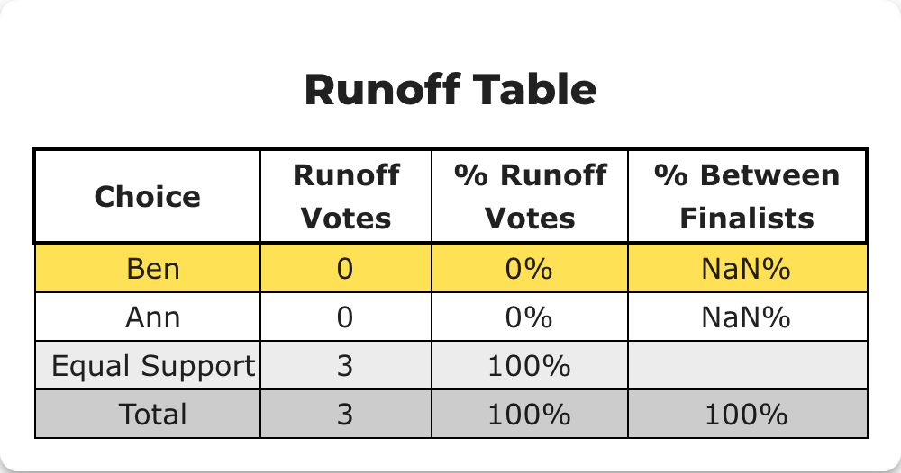
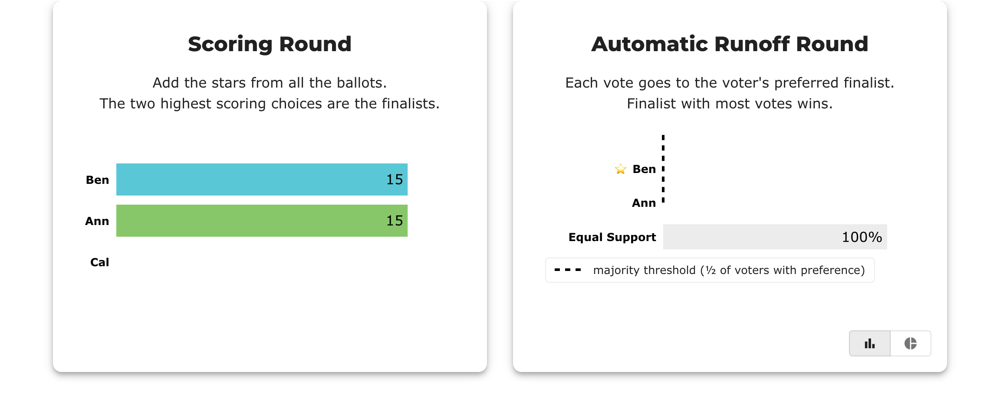
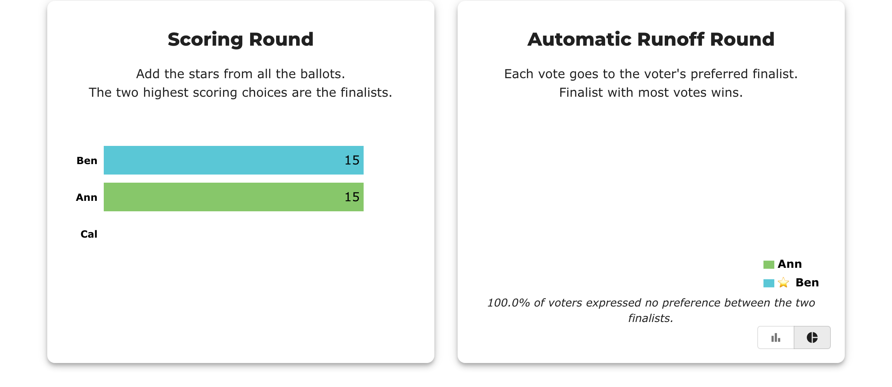

# BV-AB2 — NaN% in the runoff table when nobody prefers either finalist

> **Baseline capture — recorded before any fix.** Everything under *Actual result* is what BetterVoting
> does today (2026-08-02, production). The point of this page is to make the fix verifiable: when the
> change lands, re-run these steps and the *Expected after the fix* section is the assertion.
>
> **Provisional test ID.** `BV-AB2` is a local id, not a row in the
> [test-case sheet](https://docs.google.com/spreadsheets/d/1EXQsABY2qEu8kKQJGQdyQHn-C89hbCnNqZoGxKXZJNE/edit?gid=0#gid=0) yet.
> Paste-ready rows: [`BV-AB-sheet-rows.tsv`](BV-AB-sheet-rows.tsv).

## Purpose

Reproduce the `NaN%` of [#1035](https://github.com/Equal-Vote/bettervoting/issues/1035) from a *plain* election, and pin down which surfaces it actually appears on. The condition is not a scoring-round tie — it is the runoff denominator being zero.

## Master data

| | |
|---|---|
| Election | [`3d8qdr`](https://bettervoting.com/3d8qdr) · [results](https://bettervoting.com/3d8qdr/results) |
| Method | STAR |
| Voter access | open (anyone with the link) |
| Public results | on |

**Ballots**

```
Ann  Ben  Cal
  5    5    0
  5    5    0
  5    5    0
```

## Steps

1. Open the results page. Note the header voter count.
2. Expand **Race Details** and read the *Runoff Table*.
3. Switch the Automatic Runoff Round widget from bar to **pie** view.

## Actual result — today

Header reads **3 voters** — no ballot is an abstention here, so all three are counted.

**Runoff table — `NaN%` in "% Between Finalists":**



**Bar view** — both finalists at 0, Equal Support 100%, majority marker pinned at 0:



**Pie view** — renders completely empty, with only a legend and the footnote:



### What is wrong

`Ann` and `Ben` are each preferred over the other zero times, so `finalistVotes = 0` and `runoffVotes / finalistVotes` is `0/0`. The table prints `NaN%`.

**Correction worth recording:** the pie chart does **not** print `NaN%`. Recharts draws no sectors when every value is 0, so the label callback never runs and the chart is simply blank. An earlier prediction in this repo said both surfaces show `NaN` — only the table does. The pie has a different defect: an unexplained empty chart.

## Expected after the fix

The runoff table shows a dash, `n/a`, or a short explanatory row rather than `NaN%` — the honest statement is that no voter expressed a preference between the finalists, which is a real outcome and more informative than `0%`.

The pie view says the same in words instead of rendering an empty circle.

## Related

[#1035](https://github.com/Equal-Vote/bettervoting/issues/1035) · [comment posted](https://github.com/Equal-Vote/bettervoting/issues/1035#issuecomment-5166192037) · [`issues/1035-nan-root-cause-comment-posted.md`](../issues/1035-nan-root-cause-comment-posted.md)
