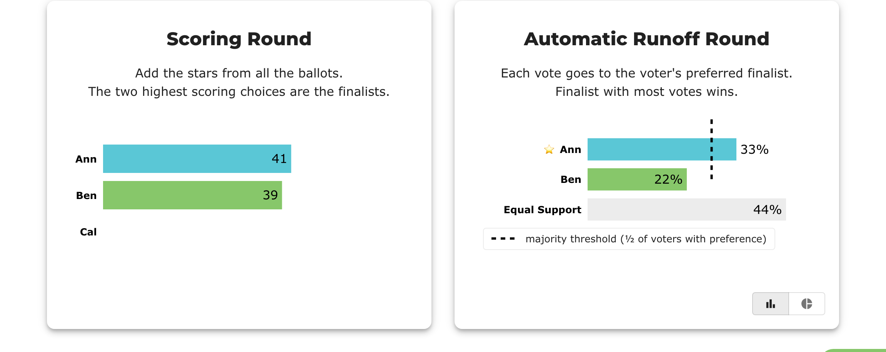
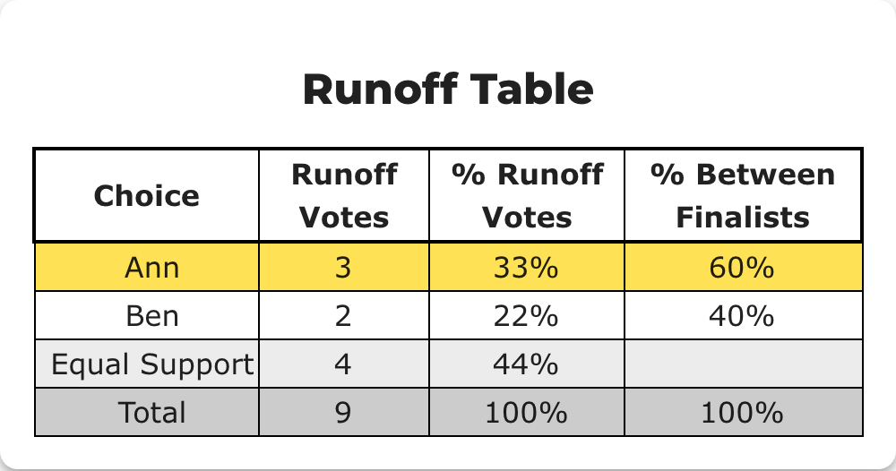

# BV2265 — runoff percentages and the majority marker use different denominators

> **Baseline capture — recorded before any fix.** Everything under *Actual result* is what BetterVoting
> does today (2026-08-02, production). The point of this page is to make the fix verifiable: when the
> change lands, re-run these steps and the *Expected after the fix* section is the assertion.
>
> **Sheet row still needed.** `BV2265` was allocated from the block after the highest id observed across
> the repos (BV2262) — it is not yet a row in the
> [test-case sheet](https://docs.google.com/spreadsheets/d/1EXQsABY2qEu8kKQJGQdyQHn-C89hbCnNqZoGxKXZJNE/edit?gid=0#gid=0).
> Paste-ready: [`BV2263-2267-sheet-rows.tsv`](BV2263-2267-sheet-rows.tsv). If it collides with an existing row, renumber here.

## Purpose

Reproduce [#1471](https://github.com/Equal-Vote/bettervoting/issues/1471) on an ordinary election where every ballot is counted — no abstentions involved, so this stands entirely on its own.

## Master data

| | |
|---|---|
| Election | [`3pfb7j`](https://bettervoting.com/3pfb7j) · [results](https://bettervoting.com/3pfb7j/results) |
| Method | STAR |
| Voter access | open (anyone with the link) |
| Public results | on |

**Ballots**

```
Ann  Ben  Cal
  5    3    0    x3   (prefer Ann)
  3    5    0    x2   (prefer Ben)
  5    5    0    x4   (rate Ann and Ben equally, but still score Cal differently)
```

## Steps

1. Open the results page.
2. Read the Automatic Runoff Round bar chart: the three bar labels, and where the dashed majority-threshold line sits.
3. Expand **Race Details** and compare against the runoff table.

## Actual result — today



The winner's bar is labelled **33%** and crosses a dashed line legended *"majority threshold (½ of voters
with preference)"*. The longest bar on the chart is **Equal Support at 44%**, belonging to neither candidate.

The table, by contrast, is unambiguous — it labels **both** denominators as separate columns:



### What is wrong

The chart's percentage labels use the sum of **all** bars (9 voters), while the majority marker is computed over **all bars except the last** (5 voters with a preference) and drawn at 2.5 votes — **27.8%** of the same axis. Two denominators, one chart, nothing telling the reader they differ.

Every number is individually correct, and the legend text is honest. The chart is still incoherent to read: a 33% winner crossing a "majority threshold", beaten in length by a 44% bar.

Note the **Runoff Table already does this properly** — `% Runoff Votes` and `% Between Finalists` are separate, labelled columns. Only the chart conflates them.

## Expected after the fix

The chart states its basis the way the table does. Any of: label the finalist bars against voters-with-a-preference (Ann 60%, Ben 40%, marker at 50%); or keep the current labels and name the marker's basis inline; or show both figures.

What must not remain is a bar labelled against one denominator sitting next to a threshold drawn against another.

## Related

[#1471](https://github.com/Equal-Vote/bettervoting/issues/1471) · [`issues/1471-chart-split-denominator.md`](../issues/1471-chart-split-denominator.md)
