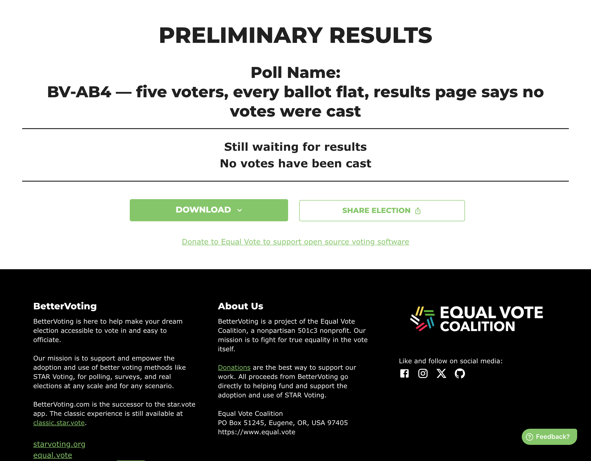

# BV2266 — five voters, and the results page says no votes were cast

> **Baseline capture — recorded before any fix.** Everything under *Actual result* is what BetterVoting
> does today (2026-08-02, production). The point of this page is to make the fix verifiable: when the
> change lands, re-run these steps and the *Expected after the fix* section is the assertion.
>
> **Sheet row still needed.** `BV2266` was allocated from the block after the highest id observed across
> the repos (BV2262) — it is not yet a row in the
> [test-case sheet](https://docs.google.com/spreadsheets/d/1EXQsABY2qEu8kKQJGQdyQHn-C89hbCnNqZoGxKXZJNE/edit?gid=0#gid=0).
> Paste-ready: [`BV2263-2267-sheet-rows.tsv`](BV2263-2267-sheet-rows.tsv). If it collides with an existing row, renumber here.

## Purpose

Reproduce [#1052](https://github.com/Equal-Vote/bettervoting/issues/1052) and [#1065](https://github.com/Equal-Vote/bettervoting/issues/1065): an election where every ballot is flat reports that nothing was cast.

## Master data

| | |
|---|---|
| Election | [`p2qrv6`](https://bettervoting.com/p2qrv6) · [results](https://bettervoting.com/p2qrv6/results) |
| Method | STAR |
| Voter access | open (anyone with the link) |
| Public results | on |

**Ballots**

```
Ann  Ben  Cal
  1    1    1
  2    2    2
  3    3    3
  4    4    4
  5    5    5
```

## Steps

1. Cast the five ballots above (already cast in the linked election).
2. Open the results page.

## Actual result — today



> **Still waiting for results**
> **No votes have been cast**

The API agrees: `nTallyVotes = 0`, `nAbstentions = 5`.

### What is wrong

Five people voted. Each rated every candidate — just equally, at their own level — so each ballot is a cast vote with no preference, not a non-vote. All five are filed as abstentions and removed from the tally, and the page then reports that nothing was cast at all.

In the Bloc STAR variant of this ([#1065](https://github.com/Equal-Vote/bettervoting/issues/1065)) the same state is reached with the results page failing to render a result it does in fact have.

## Expected after the fix

The page reports **5 voters** and a three-way tie at 15 points each, resolved by the tie-break cascade. The word "abstention" appears nowhere, because nobody abstained.

Note this case is also the one that would newly reach the BV2264 code path — worth re-running BV2264 in the same pass.

## Related

[#1052](https://github.com/Equal-Vote/bettervoting/issues/1052) · [#1065](https://github.com/Equal-Vote/bettervoting/issues/1065) · [#1407](https://github.com/Equal-Vote/bettervoting/issues/1407) · library case 08: [every ballot flat](https://masiarek.github.io/star-voting-library/01_STAR/03_Criteria/Flat_scores_ties/Flat_scores_ties_08_all_flat_zero_count.html)
