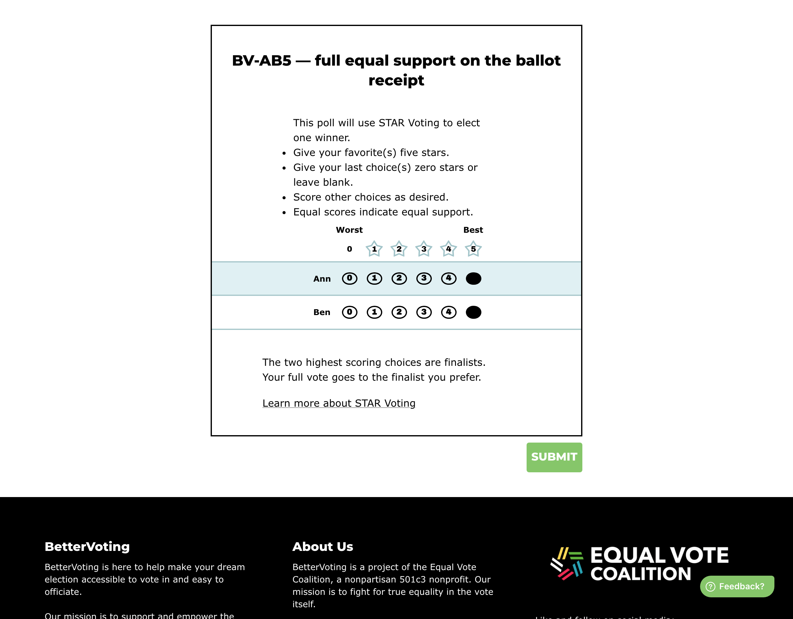
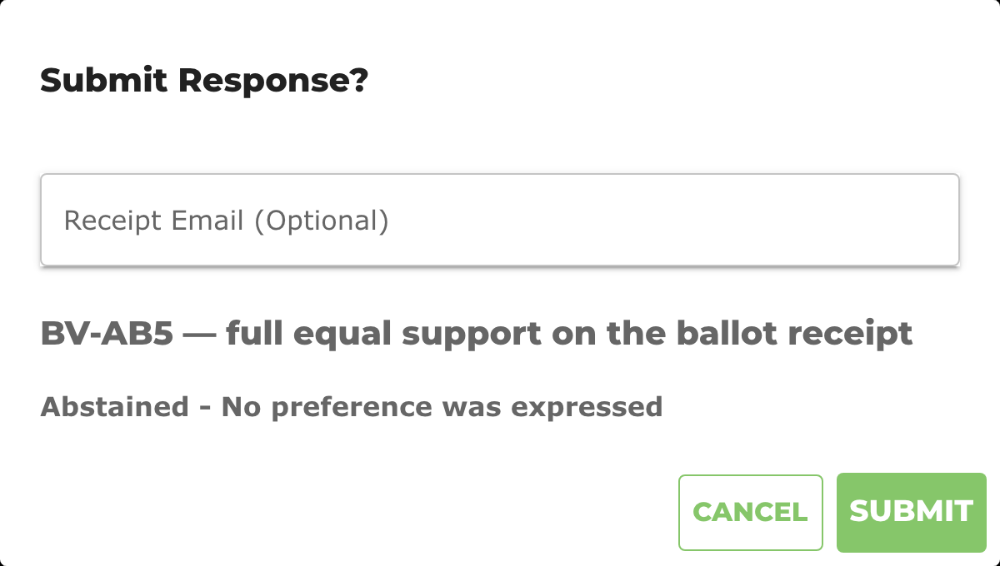

# BV2267 — full equal support is reported to the voter as an abstention

> **Baseline capture — recorded before any fix.** Everything under *Actual result* is what BetterVoting
> does today (2026-08-02, production). The point of this page is to make the fix verifiable: when the
> change lands, re-run these steps and the *Expected after the fix* section is the assertion.
>
> **Sheet row still needed.** `BV2267` was allocated from the block after the highest id observed across
> the repos (BV2262) — it is not yet a row in the
> [test-case sheet](https://docs.google.com/spreadsheets/d/1EXQsABY2qEu8kKQJGQdyQHn-C89hbCnNqZoGxKXZJNE/edit?gid=0#gid=0).
> Paste-ready: [`BV2263-2267-sheet-rows.tsv`](BV2263-2267-sheet-rows.tsv). If it collides with an existing row, renumber here.

## Purpose

Reproduce [#1053](https://github.com/Equal-Vote/bettervoting/issues/1053) at the moment it is shown to the voter: the submit confirmation for a maximal-support ballot.

## Master data

| | |
|---|---|
| Election | [`p9pvc8`](https://bettervoting.com/p9pvc8) · [results](https://bettervoting.com/p9pvc8/results) |
| Method | STAR |
| Voter access | open (anyone with the link) |
| Public results | on |

**Ballots**

```
Ann  Ben
  5    5     (one ballot, cast through the UI)
```

## Steps

1. Open the ballot: <https://bettervoting.com/p9pvc8/vote>
2. Give **Ann 5 stars** and **Ben 5 stars**.
3. Click **Submit** and read the confirmation dialog — **do not confirm**.

The linked poll is deliberately left with **zero ballots** so this stays re-runnable.

## Actual result — today

Ballot as filled in:



Confirmation dialog:



> **Abstained - No preference was expressed**

### What is wrong

The voter gave both candidates the maximum score. They expressed the strongest support the ballot allows, and are told they abstained and expressed no preference.

There is also a frontend/backend split worth testing separately: `pageIsUnderVote` in `VotePage.tsx` does not coerce `null` to `0`, while the tabulator does — so a `0, (blank)` ballot is shown a normal receipt and is then dropped as an abstention by the backend.

## Expected after the fix

The dialog reflects what the ballot says — e.g. *"Ann: 5 stars, Ben: 5 stars"* — and, if anything is added about the runoff, states it accurately: the ballot is counted, and it expresses no preference *between these two candidates*. The word "Abstained" does not appear on a ballot that has marks on it.

## Related

[#1053](https://github.com/Equal-Vote/bettervoting/issues/1053) · [analysis comment](https://github.com/Equal-Vote/bettervoting/issues/1053#issuecomment-5166296842) · [#1090](https://github.com/Equal-Vote/bettervoting/issues/1090) (the 0-score twin) · [#754](https://github.com/Equal-Vote/bettervoting/issues/754) (zeros mixed with blanks)
