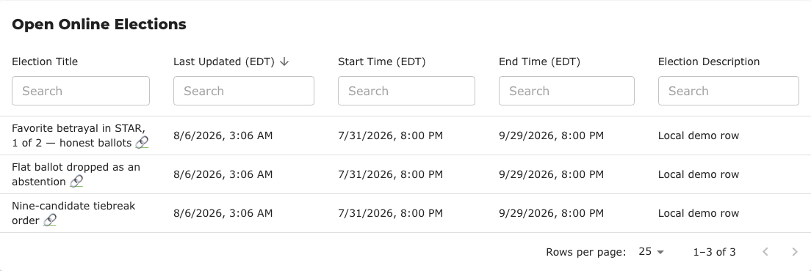
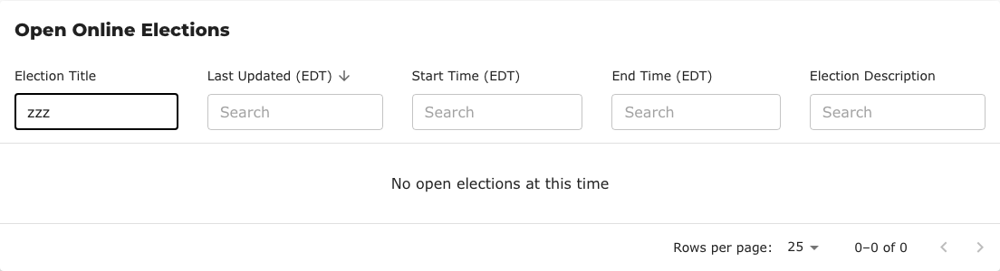

# BV2285 — finding an election by its ID, and the empty state that hides it

- [BetterVoting - test cases](https://docs.google.com/spreadsheets/d/1EXQsABY2qEu8kKQJGQdyQHn-C89hbCnNqZoGxKXZJNE/edit?gid=0#gid=0) — the canonical roster
- Upstream: [#1059](https://github.com/Equal-Vote/bettervoting/issues/1059) (ID not searchable, filed 2025-10-31) · [#1525](https://github.com/Equal-Vote/bettervoting/issues/1525) (empty state) · PR [#1524](https://github.com/Equal-Vote/bettervoting/pull/1524) (Title-or-ID search)
- Analysis: [`issues/1059-1524-search-elections-by-id.md`](../issues/1059-1524-search-elections-by-id.md) · [`issues/1525-empty-state-conflates-no-data-with-no-matches.md`](../issues/1525-empty-state-conflates-no-data-with-no-matches.md)

> **Sheet rows still needed.** `BV2285` was allocated as the next free id above the highest observed
> across the repos (`BV2284`, in the library's `BV_registry.md`) — it is **not yet a row in the
> test-case sheet**. Paste-ready: [`BV2285-sheet-rows.tsv`](BV2285-sheet-rows.tsv). If it collides,
> renumber here and in the tsv together.

---

## Why these four are one family

They came out of a single user action: an admin pasted an election ID into the only search box on `/manage` and got back *"You don't have any elections yet."* That one screen contains two independent defects, and one of them was hiding the other.

| | Defect | Upstream |
|---|---|---|
| **1** | The Title box does not match the election ID, so the search finds nothing | [#1059](https://github.com/Equal-Vote/bettervoting/issues/1059) → PR [#1524](https://github.com/Equal-Vote/bettervoting/pull/1524) |
| **2** | A search that matches nothing renders the *new-user* empty state, so the page claims the account has no elections at all | [#1525](https://github.com/Equal-Vote/bettervoting/issues/1525) |

Fixing either one alone still leaves a bad screen: fix the search and a genuinely-unmatched query still lies about your account; fix the empty state and the ID still is not findable. They are filed separately because they are separate code, but they should be **run together** — that is what this family is for.

## The cases

| Case | What it checks | Status |
|---|---|---|
| [BV2285a](BV2285a-manage-filter-zero-shows-onboarding.md) | `/manage`, filter matches nothing → onboarding copy + CREATE ELECTION button | **Expected to fail.** Read from source, not executed — see its provenance table |
| [BV2285b](BV2285b-browse-filter-zero-claims-none-exist.md) | `/browse`, filter matches nothing → "No open elections at this time" while three exist | **Expected to fail.** Executed, screenshot below |
| [BV2285c](BV2285c-empty-account-keeps-onboarding.md) | A genuinely empty account still gets the onboarding copy | **Passes today.** Regression guard for the #1525 fix |
| [BV2285d](BV2285d-title-filter-matches-election-id.md) | The Title box matches an election ID | **Fails today**; passes on PR [#1524](https://github.com/Equal-Vote/bettervoting/pull/1524) |

BV2285c exists because the obvious fix to #1525 — swapping the message — would break the case that is currently correct. A fix has to keep both.

## Test data

Three open, public elections. Any three will do; these pages use ids that are easy to tell apart from title text:

| Election ID | Title |
|---|---|
| `7mckyg` | Favorite betrayal in STAR, 1 of 2 — honest ballots |
| `hb4qvv` | Flat ballot dropped as an abstention |
| `2gvwr9` | Nine-candidate tiebreak order |

The IDs are real library elections ([BV2206](https://bettervoting.com/7mckyg/results), [BV2283](https://bettervoting.com/hb4qvv/results), [BV2262](https://bettervoting.com/2gvwr9/results)) so the titles carry meaning, but nothing here depends on their contents — only on an ID being a string that appears in no title. That last part is the point: if an ID happened to be a substring of its own title, the search would appear to work for the wrong reason.

## The screen this family is about

Three elections listed:

The same page, one word typed into the Title filter:

`0–0 of 0`, and a sentence saying there are no open elections. There are three.

## Related

[`issues/1059-1524-search-elections-by-id.md`](../issues/1059-1524-search-elections-by-id.md) also carries the **display** question this family does not test: whether the ID should be *visible* as well as searchable, and what that costs at 320px. Three prototypes are screenshotted there. No test case is written for it because nothing has been decided.
