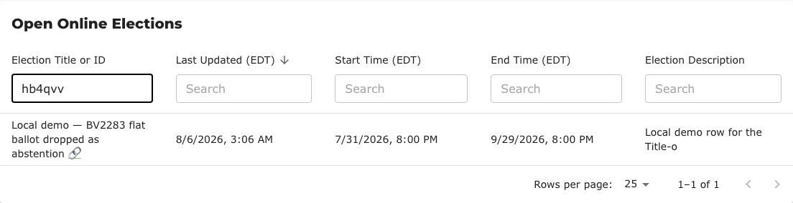
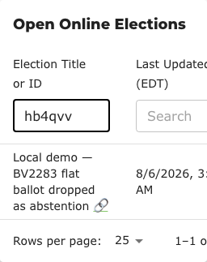

# BV2285d — searching an election table by its election ID

> **Acceptance case for PR [#1524](https://github.com/Equal-Vote/bettervoting/pull/1524).** Fails on
> `main`. The *Actual result* section records both: what `main` does, and what the PR build does.

## Purpose

Verify that an election can be found by the identifier its admin actually holds — the six-character ID in the URL, the invitation, the API and the JSON export.

Addresses the searchability half of [#1059](https://github.com/Equal-Vote/bettervoting/issues/1059). The visibility half is not covered here; see [`issues/1059-1524-…`](../issues/1059-1524-search-elections-by-id.md).

## Prerequisites

- A table built from the `title` head cell: `/manage`, `/vote_history`, `/browse`, `/public_archive` or `/invitations`. `/browse` needs no login and is the quickest.
- At least two elections listed, so a match is distinguishable from "everything shown".

## Master data

Three open, public elections — see [the family index](BV2285-index.md#test-data). **No ID may appear in any title**, or a pass proves nothing.

## Steps

Type each query into the first filter box and record the rows returned.

| # | Query | Why |
|---|---|---|
| 1 | `7mckyg` | exact ID |
| 2 | `HB4QVV` | uppercase — the title match is already case-insensitive; the ID match must be too |
| 3 | `gvwr` | partial ID — substring behaviour, consistent with every other search box |
| 4 | a distinctive word from one title | **regression**: title matching must still work |
| 5 | `zzz` | matches nothing |
| 6 | *(clear the box)* | all rows return |

## Expected result

| # | Rows |
|---|---|
| 1 | the one election with that ID |
| 2 | the one election with that ID |
| 3 | the one election whose ID contains it |
| 4 | the one election with that word in its title |
| 5 | none — and see [BV2285b](BV2285b-browse-filter-zero-claims-none-exist.md) for what the page says here |
| 6 | all three |

The column header reads **"Election Title or ID"**. That wording is asserted only loosely: what matters is that the header names both, so the behaviour is discoverable rather than hidden. A box that silently matched IDs while claiming to be a title filter would pass every row above and still be the wrong design.

## Actual result

**On `main`:** query 1 returns nothing. So do 2 and 3. Only 4 works. The header reads "Election Title".

**On PR [#1524](https://github.com/Equal-Vote/bettervoting/pull/1524):** all six as expected.

At 320px — the column count and table width are unchanged from `main`, because the PR adds no column:

## Provenance

| Claim | How established |
|---|---|
| All six queries on the PR build | **executed** — local stack, three seeded open elections, real component and API |
| Query 1 returns nothing on `main` | **executed** — same stack before the patch |
| Table width unchanged at 320px (760px both ways) | **executed** — measured in-page, both builds |
| Behaviour on `/manage` specifically | **not executed** — the change is in shared code (`EnhancedTable`), verified on `/browse` |

## Related

[#1059](https://github.com/Equal-Vote/bettervoting/issues/1059) · [PR #1524](https://github.com/Equal-Vote/bettervoting/pull/1524) · [BV2285 index](BV2285-index.md) · [`issues/1059-1524-search-elections-by-id.md`](../issues/1059-1524-search-elections-by-id.md)
