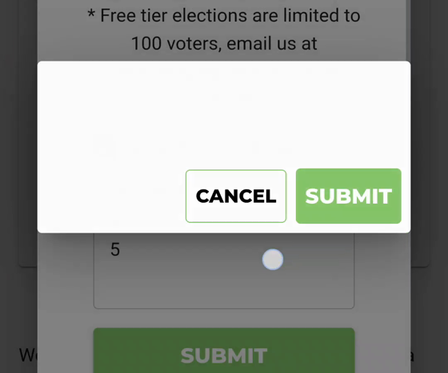

# BV250 — Manage Voters / Add Voters

- [BetterVoting - test cases](https://docs.google.com/spreadsheets/d/1EXQsABY2qEu8kKQJGQdyQHn-C89hbCnNqZoGxKXZJNE/edit?gid=0#gid=0) — the canonical roster
- [BetterVoting BPML - Use Case List](https://docs.google.com/spreadsheets/d/1liOfuP3iE4Y5saNRTwB-j5JF42yO7sp9-1owNN4CCtg/edit?gid=0#gid=0) — **needs a Manage Voters / Add Voters entry; see "BPML" below**
- Subsystem map: [`analysis/manage-voters-map.md`](../analysis/manage-voters-map.md)
- Upstream: [#1512](https://github.com/Equal-Vote/bettervoting/issues/1512) (scroll) · [#1513](https://github.com/Equal-Vote/bettervoting/issues/1513) (duplicate key) — analysis: [`issues/add-voters-duplicate-check-keys-on-email.md`](../issues/add-voters-duplicate-check-keys-on-email.md)
- Draft user documentation out of the same source reading: [`docs_proposals/help/voter_list.md`](../docs_proposals/help/voter_list.md)
- **After the fixes land, run [`BV250-post-fix-verification.md`](BV250-post-fix-verification.md)** — the acceptance list, the user stories behind it, and the traps a plausible fix falls into
- video: the reporter's, on #1512 — <https://github.com/user-attachments/assets/effc8f69-9e02-4473-8e18-c547beb42136>

> **Sheet rows still needed.** `BV250` was allocated as the next free family after `BV240`
> (preliminary-results disclaimer) — it is **not yet a row in the test-case sheet**. Paste-ready:
> [`BV250-sheet-rows.tsv`](BV250-sheet-rows.tsv). If it collides with an existing row, renumber here
> and in the tsv together.

---

## Scope

Everything on the **Manage Voters** screen of a closed-list election and the **Adding Voters** dialog
it opens: the access radios and what locks them, the roll submission path (typed and CSV), the
duplicate handling, and the mobile behaviour of the dialog itself.

Out of scope: email invitations and the Draft Email Blast (`SendEmailDialog`), voter *authentication*
at ballot time, and anything about how ballots are counted.

**Status for all 11: Ready to run.** Nothing here waits on an unmerged feature. Two of them
(BV250a, BV250b) are expected to **fail today** and are written as baseline captures — see the
column below.

## Test elections needed (3 configurations)

| Cfg | State | Voter access | Identification | Used by |
|---|---|---|---|---|
| **V1** | draft | closed (pre-defined list = Yes) | **Admin-managed voter IDs** | a, b, c, d, e, g, h, i, j, k |
| **V2** | draft | closed | **BetterVoting-managed voter IDs** (email) | b (email arm), f |
| **V3** | **finalized / open** | closed, admin-managed, roll already populated | — | e (the non-draft arm) |

Notes on setup:

- **Adding the first voter is a one-way door on a non-draft election.** Both radio groups disable on
  `state !== 'draft' || rolls.length > 0` (`ViewElectionRolls.tsx:119`, `:145`), and CLEAR VOTER LIST
  only exists while the election is a draft. So V1 is consumed by any case that adds a voter —
  **make a fresh draft per run**, or clear the roll between cases.
- Method, candidates and races are irrelevant to every case here. Use the smallest template.
- BV250h and BV250i are the mobile cases and need a real narrow viewport: a phone, or devtools at
  360 x 780 with touch emulation. A desktop window narrowed to 360 px does not reproduce the
  auto-hiding overlay scrollbar that made the reporter's session confusing.
- Test accounts: the sheet's testing-credentials tab, not here.

---

## Tier 1 — the duplicate path (the two that fail today)

### BV250a — a voter-ID list of two rows is reported as duplicate emails
**Cfg:** V1 · **Automate:** y · **Expect: FAIL today**

1. On Manage Voters, confirm **Yes** to a pre-defined voter list and **Admin-managed voter IDs**.
   Leave the Email checkbox unticked.
2. ADD VOTERS.
3. Type two distinct voter IDs, one per row:
   ```
   alpha
   bravo
   ```
4. SUBMIT.

**Expected:** the two voters are added. No prompt.

**Actual today:** *"You entered duplicate emails, which is not supported. Would you like us to remove
duplicates?"* — naming a field that is not in use and contains nothing. Root cause: both
`duplicatesExist` and `removeDuplicates` key on `roll.email`, which is `undefined` for every row in
this mode, so all rows collide on `""`.

→ full page: [`BV250a-voter-id-list-flagged-as-duplicate-emails.md`](BV250a-voter-id-list-flagged-as-duplicate-emails.md)

### BV250b — answering YES adds one voter and discards the rest, silently
**Cfg:** V1 · **Automate:** y · **Expect: FAIL today**

1. As BV250a, but submit **three** distinct IDs and note the roll count before you start.
2. Answer **YES** to the duplicate prompt.
3. Count the roll.

**Expected:** three voters added; if the tool really did remove duplicates it says how many.

**Actual today:** the roll grows by **one**. Two rows are dropped with no message and no count.
Observed in the reporter's video as 2 → 3 → 4 → 5 across submissions of 3, 2 and 1 rows.

**Second arm (V2, email mode):** the same three-row submission with distinct *emails* is expected to
**pass** — the key is correct there. Run both arms; the contrast is the diagnosis.

→ full page: [`BV250b-duplicate-removal-discards-rows.md`](BV250b-duplicate-removal-discards-rows.md)

### BV250c — answering NO adds nothing and says nothing
**Cfg:** V1 · **Automate:** y

→ full page: [`BV250c-answering-no-adds-nothing.md`](BV250c-answering-no-adds-nothing.md)

1. As BV250a. Answer **NO**.
2. Look at the roll and at the dialog.

**Expected:** either the voters are added, or the admin is told plainly that nothing was added and
why.

**Predicted actual (from source, `AddElectionRoll.tsx:99`):** `onSubmit` returns without posting; the
dialog stays open with the text still in it and no message. So the two answers on offer are "add one
voter" and "add none". *Marked as a prediction — confirm in the browser.*

### BV250d — a genuinely duplicated voter ID is caught
**Cfg:** V1 · **Automate:** y

→ full page: [`BV250d-genuine-duplicate-is-caught.md`](BV250d-genuine-duplicate-is-caught.md)

Submit `alpha / bravo / alpha`. **Expected:** the prompt fires (it should, here), and YES adds
**two** voters. This is the case that has to keep passing after the key is fixed — it is the reason
the check exists.

---

## Tier 2 — input format and column handling

### BV250e — the roll table reflects exactly what was submitted
**Cfg:** V1 then V3 · **Automate:** y

→ full page: [`BV250e-roll-table-reflects-submission.md`](BV250e-roll-table-reflects-submission.md)

Submit a known list, then read the Voters table back. **Expected:** same count, same IDs, all rows
`Not Voted`. On V3 (finalized) additionally confirm the access radios are disabled and
CLEAR VOTER LIST is **absent** — the lock is only undoable in draft.

### BV250f — two ticked columns require a comma per row
**Cfg:** V2 · **Automate:** y

→ full page: [`BV250f-two-columns-require-a-comma.md`](BV250f-two-columns-require-a-comma.md)

Tick both Voter ID and Email, then submit a row with no comma.
**Expected:** the error names the format. **Actual today:** the snackbar reads
`Incorrect number of columns: <row>` and the dialog's own instruction line only says
*"(1 voter per row, no spaces)"*, never that the row is comma-separated. Assert on the requirement
(the admin can tell what to type next), not on the literal string.

### BV250g — CSV import takes the same path
**Cfg:** V1 · **Automate:** n

→ full page: [`BV250g-csv-import-takes-the-same-path.md`](BV250g-csv-import-takes-the-same-path.md)

Load a CSV with header `voter_id` and three distinct rows. **Expected:** three voters.
**Predicted actual:** the same duplicate prompt and the same one-row outcome — `handleLoadCsv`
(`:137`, `:146`) calls the identical pair of functions. *Prediction; confirm.* Also check the two
documented guards: a bad header (`Invalid headers`) and a non-text file (`Invalid data type`) both
`alert()` rather than using the snackbar, which is inconsistent with every other error on this screen.

---

## Tier 3 — the dialog on a phone (this is #1512's territory)

### BV250h — the Adding Voters dialog scrolls itself, not the page
**Cfg:** V1, narrow viewport · **Automate:** n

→ full page: [`BV250h-add-voters-dialog-scrolls-itself.md`](BV250h-add-voters-dialog-scrolls-itself.md)

1. Open ADD VOTERS on a 360 px-wide viewport.
2. Note where the page behind the modal is scrolled to.
3. Scroll inside the dialog; press SUBMIT with the field empty.

**Expected:** any feedback appears without the admin hunting for it, and the page **behind** the
modal does not move.

**Actual today:** the background does move (visible in the reporter's video at 18–20 s). Note this
dialog has no scroll-to-error of its own — its failures go to a snackbar at the bottom of the
*viewport*, which can land over the dialog's own buttons. So a fix to `scrollToElement` for #1512
does **not** fix this screen; check both.

### BV250i — the race dialog scrolls to its error, on a phone
**Cfg:** any draft election, narrow viewport · **Automate:** n · **Expect: FAIL today**

→ full page: [`BV250i-race-dialog-scrolls-to-its-error.md`](BV250i-race-dialog-scrolls-to-its-error.md)

The case that matches #1512's *written steps*. Add a race, give it a title and one candidate only,
press SAVE.

**Expected:** the dialog scrolls its own content so *"Must have at least 2 candidates"* is visible.
**Actual today:** the dialog does not move; the page behind it does.
→ [`issues/1512-scroll-save-review.md`](../issues/1512-scroll-save-review.md)

### BV250j — the confirm dialog is never blank
**Cfg:** V1, narrow viewport or a throttled CPU · **Automate:** n

→ full page: [`BV250j-confirm-dialog-is-never-blank.md`](BV250j-confirm-dialog-is-never-blank.md)

Trigger any confirm on this screen (CLEAR VOTER LIST is the easiest) and watch it **close**.

**Expected:** the box carries its text and its own button labels for as long as it is on screen.
**Actual today:** `ConfirmationDialogProvider.tsx:46` clears title, message and both labels
synchronously with `isOpen: false`, so the fade-out renders an **empty box with the default
CANCEL / SUBMIT labels**. Caught three times in a 40-second recording on a mid-range Android.
Cosmetic, but it is why a tester's screenshot can show a confirm dialog with nothing in it.



### BV250k — the voter table fits the viewport
**Cfg:** V1 with 3+ voters, narrow viewport · **Automate:** n

→ full page: [`BV250k-voter-table-fits-the-viewport.md`](BV250k-voter-table-fits-the-viewport.md)

**Expected:** Voter ID / Email / Has Voted and the `Rows per page … 1–N of N` footer are all
reachable without horizontal page scrolling.
**Actual today:** the table is clipped at the right edge with its own horizontal scrollbar and the
footer runs off-screen. Layout only. **Check for a duplicate before filing** — plausibly already
covered by [#704](https://github.com/Equal-Vote/bettervoting/issues/704) or
[#1170](https://github.com/Equal-Vote/bettervoting/issues/1170).

---

## Which of these actually catch bugs

BV250a and BV250b (the duplicate key — silent data loss, unfiled), BV250c (the NO branch),
BV250g (the CSV twin of the same bug), BV250i (#1512 as written). The other six are confirmation and
boundary.

## BPML

The [Use Case List](https://docs.google.com/spreadsheets/d/1liOfuP3iE4Y5saNRTwB-j5JF42yO7sp9-1owNN4CCtg/edit?gid=0#gid=0)
has no entry for this flow. Suggested rows, in the order an admin meets them:

| Use case | Actor | Trigger | Notes |
|---|---|---|---|
| Restrict an election to a pre-defined voter list | Election admin | Manage Voters | One-way door once a voter exists; undoable only in draft |
| Choose voter identification (BV-managed vs admin-managed IDs) | Election admin | Manage Voters | Locks with the above |
| Add voters to the roll (typed) | Election admin | ADD VOTERS | The BV250a/b failure lives here |
| Add voters to the roll (CSV import) | Election admin | ADD VOTERS | Same code path, different entry |
| Clear the voter list | Election admin | CLEAR VOTER LIST | Draft only; the unlock mechanism |
| Review roll and voting status | Election admin | Voters table | `Has Voted` column |
| Invite voters by email | Election admin | DRAFT EMAIL BLAST | Email mode only — **out of BV250's scope**, own family |

## Open questions

1. **Which screen is #1512 for?** Its steps and its video disagree (race dialog vs Adding Voters).
   Needs a call from whoever picks it up.
2. **Should a partial roll submission be possible at all?** Today YES posts a silently truncated
   list. Rejecting the whole submission and telling the admin which rows collided is arguably the
   safer contract for a voter roll — worth asking before the fix is written, because it changes it.
3. **Should `Add Voters` be reachable at all once the election is finalized?** It is, and it still
   adds voters — but the settings it locks can no longer be unlocked. Deliberate, or a gap?
